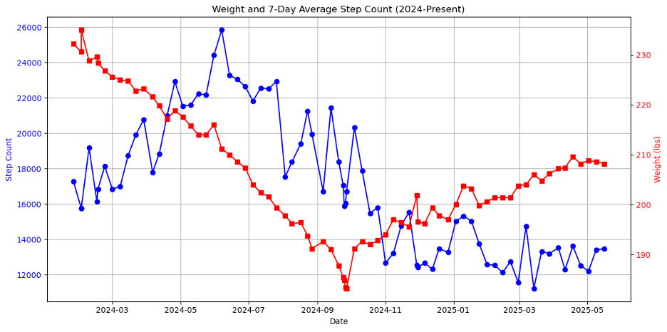

# 📊 Apple Health Data Analysis for Fitness Tracking

This project analyzes Apple Health export data to visualize and understand daily step counts, weight trends, and caloric needs. It is designed for individuals who consistently lift weights (5 times per week) and track their diet to match maintenance or goal-based calorie needs.

## 🏋️‍♂️ Project Background

The subject of this analysis:
- Lifts weights **five times a week**.
- Controls diet to align with calculated **maintenance calories**.
- Uses **Apple Health** to track daily step counts and weekly weight entries.

By extracting and cleaning Apple Health XML data, this project allows for:
- **Visual correlation** between step count activity and weight fluctuations.
- **Trend analysis** to assess if physical activity aligns with weight management goals.

## 📂 Features

- Parses `export.xml` from Apple Health.
- Extracts `HKQuantityTypeIdentifierStepCount` and `HKQuantityTypeIdentifierBodyMass` data.
- Cleans, aggregates, and joins step and weight data by date.
- Plots:
  - Daily step counts (7-day rolling average)
  - Body weight over time

## 🧰 Technologies

- Python 3
- Pandas
- Matplotlib
- ElementTree (for XML parsing)

## 📈 Example Visualization



One plot overlays:
- **7-day average step count** (left axis)
- **Body weight** (right axis)

This enables intuitive understanding of how lifestyle habits influence weight over time.

## 🗂️ Usage Instructions

1. Export your Apple Health data from the iPhone Health app.
2. Replace the path in the script to point to your `export.xml`:
   ```python
   tree = ET.parse('path/to/your/export.xml')
   ```
3. Run the notebook to generate cleaned data and visualizations.

## 📌 Notes

- Only data from **2024 onward** is used in the analysis.
- Step counts are **aggregated to 7-day averages** to reduce noise.

## 🔒 Privacy

Ensure you handle your health data securely. Do not upload your Apple Health export publicly without redacting personal information.
